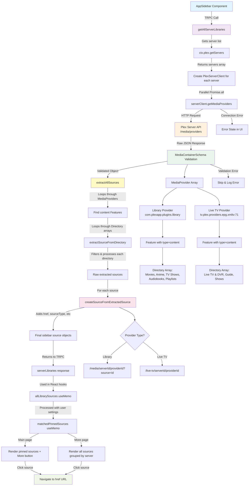

# Plex Data Flow Documentation

This document explains the complete data flow for fetching and displaying Plex library sources in the sidebar, from the UI component to the Plex API and back.

## Data Flow Diagram



## Overview

The application fetches library data from multiple Plex Media Servers and displays them in a sidebar with pinned sources and a "More" page showing all available libraries grouped by server.

## Architecture Components

### 1. UI Layer (`src/components/app-sidebar.tsx`)
- **AppSidebar Component**: Main sidebar component that displays library sources
- **Two-page design**: 
  - Page 1: Home + pinned sources + More button
  - Page 2: All sources grouped by server with back button
- **State Management**: Uses `useState` for page navigation
- **Data Dependencies**: Requires `servers`, `userInfo`, and `serverLibraries` props

### 2. API Layer (`src/server/api/routers/plex.ts`)
- **TRPC Router**: Defines API endpoints for Plex operations
- **Key Endpoints**:
  - `getServers`: Get all available Plex servers
  - `getUserInfo`: Get user settings including pinned sources
  - `getAllServerLibraries`: Get library data from all servers (main endpoint)

### 3. Client Layer (`src/lib/plex.tv/client.ts` & `src/plugins/plex/`)
- **PlexTVClient**: Handles authentication and server discovery
- **PlexServerClient**: Handles individual server communication
- **Connection Management**: Tests connections, handles fallbacks, retry logic

### 4. Schema Layer (`src/lib/plex.tv/schemas.ts`)
- **MediaContainerSchema**: Validates API responses from Plex servers
- **Composed Schemas**: Built from smaller, focused schemas (LibrarySection, PlaylistDirectory, etc.)
- **Type Safety**: Provides TypeScript types for all data structures

### 5. Processing Layer (`src/lib/plex.tv/utils.ts`)
- **extractAllSources**: Processes MediaContainer to extract library sources
- **createSourceFromExtractedSource**: Converts extracted data to sidebar-compatible format
- **URL Generation**: Creates proper navigation URLs for each source type

## Detailed Data Flow

### Step 1: Page Load & TRPC Call
```typescript
// app-sidebar.tsx receives serverLibraries from TRPC
const { data: serverLibraries } = api.plex.getAllServerLibraries.useQuery();
```

### Step 2: TRPC Handler Execution
```typescript
// plex.ts - getAllServerLibraries handler
getAllServerLibraries: protectedProcedure.query(async ({ ctx }) => {
  const servers = await ctx.plex.getServers(); // Get list of servers
  
  // Fetch library data for all servers in parallel
  const serverLibrariesPromises = servers.map(async (server) => {
    const serverClient = ctx.plex.createServerClient(server);
    const mediaProviders = await serverClient.getMediaProviders();
    return { serverId, serverName, mediaProviders };
  });
  
  return await Promise.all(serverLibrariesPromises);
});
```

### Step 3: Server Client Communication
```typescript
// PlexServerClient.getMediaProviders()
async getMediaProviders() {
  const response = await this.get({
    endpoint: "media/providers",
    schema: MediaContainerSchema, // Validates response
  });
  return response;
}
```

### Step 4: Schema Validation
The raw JSON from Plex API gets validated against `MediaContainerSchema`:

```typescript
// MediaContainerSchema structure
{
  MediaContainer: {
    MediaProvider: [
      {
        identifier: "com.plexapp.plugins.library",
        title: "Library",
        Feature: [
          {
            type: "content",
            Directory: [
              { id: "1", title: "Movies", type: "movie", ... },
              { id: "4", title: "Anime", type: "show", ... },
              { id: "playlists", title: "Playlists", type: "playlist", ... }
            ]
          }
        ]
      },
      {
        identifier: "tv.plex.providers.epg.xmltv:71",
        title: "Live TV & DVR",
        Feature: [
          {
            type: "content",
            Directory: [
              { id: "tv.plex.providers.epg.xmltv:71", title: "Live TV & DVR", ... }
            ]
          }
        ]
      }
    ]
  }
}
```

### Step 5: Source Extraction
```typescript
// utils.ts - extractAllSources()
export function extractAllSources(mediaContainer: MediaContainer) {
  const sources = [];
  
  // Process ALL MediaProviders
  for (const provider of mediaContainer.MediaContainer.MediaProvider) {
    // Find content feature with Directory array
    const contentFeature = provider.Feature.find(
      feature => feature.type === "content" && feature.Directory
    );
    
    // Extract sources from each Directory
    for (const directory of contentFeature.Directory) {
      const source = extractSourceFromDirectory(directory, provider.title, provider.identifier);
      if (source) sources.push(source);
    }
  }
  
  return sources;
}
```

### Step 6: Source Processing
```typescript
// createSourceFromExtractedSource() generates final sidebar objects
{
  key: "server-{serverId}-section-{sectionId}",
  sourceType: "movies|tv|music|playlist|Live TV & DVR",
  machineIdentifier: serverId,
  directoryID: sectionId,
  title: "Movies|Anime|Playlists|Live TV & DVR",
  serverFriendlyName: "Augie's Haus",
  isLibrarySection: true|false,
  href: "/media/{serverId}/{providerId}?source={sectionId}" | "/live-tv/{serverId}/{providerId}"
}
```

### Step 7: UI Rendering
```typescript
// app-sidebar.tsx processes sources for display
const allLibrarySources = useMemo(() => {
  // Extract and convert all sources from server responses
}, [serverLibraries]);

const matchedPinnedSources = useMemo(() => {
  // Match pinned sources from user settings with real library data
}, [pinnedSources, allLibrarySources]);

// Render based on current page
{currentPage === "main" ? (
  // Show Home + pinned sources + More button
  {matchedPinnedSources.map(source => <Link href={source.href}>...)}
) : (
  // Show all sources grouped by server
  {servers.map(server => 
    librarySourcesByServer[server.id].map(source => <Link href={source.href}>...)
  )}
)}
```

## URL Generation

The system generates different URL patterns based on source type:

- **Library Sections**: `/media/{serverId}/{providerId}?source={sectionId}`
  - Movies: `/media/0019.../com.plexapp.plugins.library?source=1`
  - Playlists: `/media/0019.../com.plexapp.plugins.library?source=playlists`

- **Live TV & DVR**: `/live-tv/{serverId}/{providerId}`
  - Live TV: `/live-tv/0019.../tv.plex.providers.epg.xmltv:71`

## Error Handling

- **Server Connection Failures**: Gracefully handled with error states in UI
- **Schema Validation Errors**: Logged and skipped, preventing app crashes
- **Parallel Processing**: Uses `Promise.all` with individual error handling per server
- **Fallback URLs**: Generated for sources without proper href data

## Data Transformation Pipeline

```
Raw Plex API JSON
    ↓ (Schema Validation)
MediaContainer Object
    ↓ (extractAllSources)
Extracted Sources Array
    ↓ (createSourceFromExtractedSource)  
Sidebar Source Objects
    ↓ (UI Processing)
Rendered Sidebar Items
```

## Key Features

1. **Multi-Provider Support**: Handles both Library and Live TV providers
2. **Parallel Server Processing**: Fetches from multiple servers simultaneously
3. **Type Safety**: Full TypeScript support throughout the pipeline
4. **Error Resilience**: Graceful degradation when servers are unavailable
5. **URL Generation**: Proper navigation URLs for each source type
6. **Icon Mapping**: Appropriate icons based on content type
7. **Pinned Source Matching**: Intelligent matching of user preferences with real data 